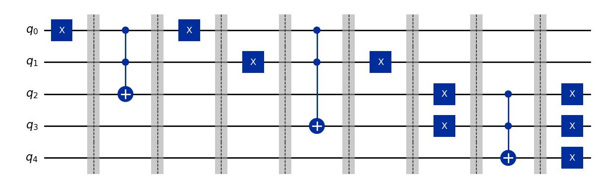

# 🧑‍💻 Extensão da biblioteca Qiskit: Integração de Lógica Fuzzy na Computação Quântica

## 📜 Introdução
A fusão entre **Lógica Fuzzy** e **Computação Quântica** tem o potencial de revolucionar o processamento de incertezas em sistemas complexos. Este projeto estende a funcionalidade do **Qiskit**, implementando operadores fuzzy para manipulação de incertezas diretamente em circuitos quânticos. 

A biblioteca permite construir e testar circuitos fuzzy interativos, aproveitando as propriedades únicas da mecânica quântica, como **superposição** e **emaranhamento**.

Este projeto implementa uma **biblioteca inovadora** que integra **Lógica Fuzzy (LF) e Computação Quântica (CQ)**, permitindo a modelagem e execução de operadores fuzzy em circuitos quânticos. A biblioteca permite a **composição modular** de circuitos, onde operadores fuzzy podem ser adicionados interativamente sem a necessidade de reconfiguração completa.

Além disso, os circuitos podem ser simulados localmente e **executados em hardware quântico real** via IBM Quantum Experience.

## 🚀 Funcionalidades
- Implementação de **operadores fuzzy** como XOR Fuzzy, implicações fuzzy e conectivos lógicos.
- **Construção interativa** de circuitos quânticos.
- **Simulação local** e execução em **dispositivos quânticos reais**.
- **Visualização de circuitos** utilizando Matplotlib.
- **Geração de histogramas** com os resultados das medições.


## 📌 Principais operações disponíveis:
- **T Norma do Produto**: equivalente à porta Toffoli.
- **Operação OR fuzzy**
- **XOR Fuzzy**: diferentes versões (`ominus`, `oplus`, `otimes`)
- **Implicação fuzzy (S, N)**
- **Implicação fuzzy (QL)**
- **Medição e geração de histogramas**

## 📊 Exemplo de Circuito Gerado
A biblioteca permite visualizar os circuitos de forma gráfica utilizando Matplotlib



## 🛠️ Requisitos

### 🔧 Dependências Principais:
- **Qiskit**: Framework para computação quântica.
- **Matplotlib**: Para visualização de circuitos.
- **NumPy**: Manipulação de matrizes e cálculos matemáticos.

## 🎮 Como Usar

Para iniciar o programa e interagir com as operações fuzzy no circuito:

```bash
python main.py

## 📬 Contato

📧 Email: cescbotelho@gmail.com
🔗 GitHub: [CeciliaBotelho](https://github.com/CeciliaBotelho)
